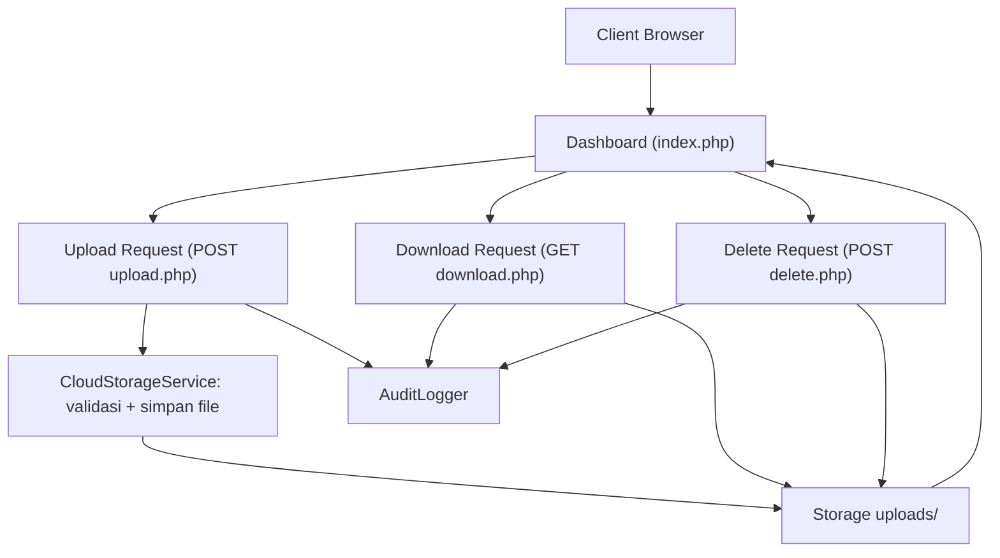

# Laporan Praktik Cloud Computing

## Identitas Praktikum
- Mata Kuliah: Cloud Computing
- Semester: 6
- Nama: `Isi nama`
- NIM: `Isi NIM`
- Kelas: `Isi kelas`
- Tanggal Praktik: `Isi tanggal`

## Ringkasan Tujuan
Praktik ini menguji implementasi *Anwar Group Document Hub* (portal dokumen internal) berbasis web untuk operasi utama:
1. Upload file
2. Verifikasi file muncul pada sistem
3. Download file
4. Delete file
5. Akses sistem dari browser lain
6. Rename file (fitur enterprise tambahan)

## Arsitektur Sistem
Sistem menggunakan pola client-server:
1. Client: Browser (Chrome/Firefox/Edge/dll)
2. Application Layer: PHP (endpoint `index.php`, `upload.php`, `download.php`, `delete.php`)
3. Service Layer: `CloudStorageService`, `AuditLogger`, `CsrfManager`
4. Storage Layer: Folder `uploads/` sebagai object storage lokal
5. Audit Layer: `logs/audit.log` untuk jejak aktivitas

## Alur Sistem

## Screenshot Wajib
Simpan screenshot pada folder `docs/screenshots/` lalu isi tabel berikut.

| No | Nama File Screenshot | Keterangan |
|---|---|---|
| 1 | `01-dashboard-awal.png` | Dashboard saat belum ada aksi |
| 2 | `02-upload-berhasil.png` | Bukti upload sukses |
| 3 | `03-file-muncul-di-daftar.png` | File tampil pada tabel |
| 4 | `04-download-berhasil.png` | Bukti download file |
| 5 | `05-delete-berhasil.png` | Bukti delete file |
| 6 | `06-akses-browser-lain.png` | Bukti akses dari browser berbeda |
| 7 | `07-audit-trail.png` | Bukti event log upload/download/delete |

## Penjelasan Teknis
### 1. Mekanisme Upload
- Request `POST` diterima `upload.php`.
- Validasi `CSRF token`, ukuran file, ekstensi, dan MIME type.
- File disimpan ke folder `uploads/` dengan sanitasi nama file.
- Event dicatat ke `logs/audit.log`.

### 2. Mekanisme Menampilkan File
- `index.php` memanggil `CloudStorageService::listFiles()`.
- Metadata yang ditampilkan: nama, tipe, ukuran, waktu modifikasi.
- Data dirender dalam tabel dan bisa dicari via search input.

### 3. Mekanisme Download
- `download.php` menerima parameter file.
- File diverifikasi melalui `resolveFile()`.
- Server mengirim header download (`Content-Disposition`) dan stream file.
- Event download dicatat ke audit log.

### 4. Mekanisme Delete
- Delete dilakukan via form `POST` (bukan GET).
- Token keamanan diverifikasi.
- File dihapus dari storage jika valid.
- Event delete dicatat ke audit log.

### 5. Mekanisme Rename
- Rename dilakukan via endpoint `POST rename.php`.
- Sistem mempertahankan ekstensi file asli untuk keamanan.
- Nama baru disanitasi dan dicek konflik nama file.
- Event rename dicatat ke audit log.

### 6. Keamanan Dasar
- CSRF token untuk upload/delete/rename.
- Sanitasi nama file mencegah path traversal.
- Whitelist ekstensi dan MIME type.
- Input divalidasi sebelum akses file fisik.

## Hasil Pengujian
| Skenario | Langkah Uji | Hasil Diharapkan | Hasil Aktual | Status |
|---|---|---|---|---|
| Upload file | Pilih file lalu klik Upload | File tersimpan di server | `Isi hasil` | `Pass/Fail` |
| File muncul | Refresh dashboard | File muncul di tabel daftar file | `Isi hasil` | `Pass/Fail` |
| Download file | Klik tombol Download | File terunduh ke client | `Isi hasil` | `Pass/Fail` |
| Delete file | Klik tombol Delete | File hilang dari tabel & storage | `Isi hasil` | `Pass/Fail` |
| Browser lain | Buka URL sama di browser lain | Data file yang sama dapat diakses | `Isi hasil` | `Pass/Fail` |
| Rename file | Klik tombol Rename lalu simpan nama baru | Nama file berubah tanpa ubah ekstensi | `Isi hasil` | `Pass/Fail` |

## Analisis Cloud (Enterprise Perspective)
### 1. Kesesuaian Konsep Cloud
- On-demand file service: user dapat upload/download/delete kapan saja.
- Resource pooling: semua client mengakses storage endpoint yang sama.
- Broad network access: sistem dapat diakses multi-browser.

### 2. Kelebihan Desain
- Modular service layer mempermudah scaling fitur.
- Audit trail membantu monitoring dan incident tracing.
- Validasi berlapis mengurangi risiko upload file berbahaya.

### 3. Keterbatasan Saat Ini
- Storage masih local filesystem (belum object storage terdistribusi).
- Belum ada autentikasi user/role-based access control.
- Belum ada antivirus scanning dan encryption-at-rest.

### 4. Rekomendasi Peningkatan
1. Migrasi storage ke S3-compatible object storage.
2. Tambah autentikasi JWT/SSO + role permission.
3. Tambah observability (metrics, alerting, centralized logging).
4. Implementasi lifecycle policy dan versioning file.

## Kesimpulan
`Tulis kesimpulan akhir berdasarkan hasil uji hari ini.`
