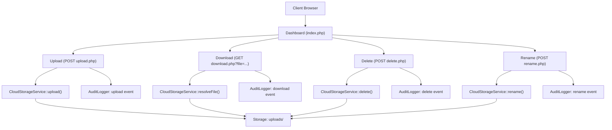

# Laporan Praktik Cloud Computing
## Implementasi dan Pengujian Anwar Group Document Hub

## 1. Identitas Praktikum
- Mata Kuliah: Cloud Computing
- Semester: 6
- Tanggal Praktik: 21 April 2026
- Hari: Selasa
- Lokasi Uji: Lingkungan lokal XAMPP (`Apache`)
- Aplikasi: `Anwar Group Document Hub`
- URL Uji: `http://localhost/simple_cloud/`

## 2. Ringkasan Eksekutif
Praktik hari ini bertujuan memvalidasi alur utama layanan penyimpanan dokumen berbasis web: upload, verifikasi file muncul, download, delete, dan akses dari client/browser lain. Pengujian dilakukan end-to-end pada tanggal **21 April 2026** dengan hasil seluruh skenario inti berstatus **PASS**.

Secara arsitektur, sistem berjalan dengan model client-server: browser sebagai client, PHP endpoint sebagai application layer, folder `uploads/` sebagai storage layer, dan `logs/audit.log` sebagai audit layer. Dari sisi konsep cloud, sistem sudah mencerminkan resource sharing, network access, dan on-demand operation dalam skala laboratorium.

## 3. Latar Belakang Konsep Sistem
Konsep yang digunakan pada proyek ini adalah **Enterprise Document Hub** untuk ekosistem internal holding, bukan file-sharing publik. Artinya:
1. Sistem diposisikan sebagai gerbang dokumen resmi antar unit/departemen.
2. Fokusnya adalah kontrol dokumen operasional harian (upload/download/rename/delete).
3. Tiap aksi tercatat ke audit log untuk kebutuhan monitoring dan jejak aktivitas.

Dengan konsep ini, keberadaan banyak entitas di bawah holding tetap masuk akal karena layanan bersifat internal, terpusat, dan terdokumentasi.

## 4. Lingkungan dan Konfigurasi Uji
### 4.1 Perangkat Lunak
1. OS: Windows
2. Web Server: Apache (XAMPP)
3. Runtime: PHP (XAMPP)
4. Aplikasi: PHP modular (`index.php`, `upload.php`, `download.php`, `delete.php`, `rename.php`)

### 4.2 Struktur Komponen Inti
1. UI Layer: `index.php`
2. Service Layer: `src/Services/CloudStorageService.php`
3. Security Layer: `src/Security/CsrfManager.php`
4. Audit Layer: `src/Services/AuditLogger.php`
5. Storage Layer: folder `uploads/`
6. Bukti uji otomatis: folder `docs/evidence/`

## 5. Alur Sistem

## 6. Penjelasan Teknis
### 6.1 Upload File
1. User memilih file di dashboard.
2. Form mengirim `POST` ke `upload.php` dengan `csrf_token`.
3. Sistem memvalidasi:
   - metode request,
   - token CSRF,
   - batas ukuran file,
   - whitelist ekstensi,
   - kecocokan MIME type.
4. File valid dipindahkan ke `uploads/`.
5. Event dicatat pada `logs/audit.log`.

### 6.2 Verifikasi File Muncul
1. `index.php` memanggil `CloudStorageService::listFiles()`.
2. Metadata dirender ke tampilan List/Grid.
3. User dapat memverifikasi file yang baru diunggah muncul di repository.

### 6.3 Download File
1. User klik tombol Download.
2. Endpoint `download.php` melakukan sanitasi nama file dan resolve path aman.
3. Server mengirim file sebagai attachment.
4. Event download dicatat di audit log.

### 6.4 Delete File
1. User klik Delete (form `POST` + CSRF).
2. Sistem validasi request dan nama file.
3. File dihapus dari `uploads/`.
4. Event delete dicatat di audit log.

### 6.5 Akses dari Browser Lain
1. URL yang sama diakses dengan client lain (user-agent berbeda).
2. Server merespons status `200`.
3. Halaman dashboard dan daftar repository dapat diakses.

## 7. Metodologi Pengujian Hari Ini
Pengujian dilakukan end-to-end dengan urutan:
1. Generate file uji teks.
2. Upload file via endpoint aplikasi.
3. Cek file tampil di repository.
4. Download file yang sama.
5. Verifikasi integritas file melalui hash SHA-256.
6. Delete file dari server.
7. Verifikasi file hilang dari daftar dan storage fisik.
8. Simulasi akses client lain dengan user-agent browser berbeda.

## 8. Data Uji dan Evidensi
### 8.1 Data Uji Utama
1. Waktu uji: `2026-04-21 23:10:26 +08:00`
2. Nama file uji lokal: `AGDH_praktek_20260421_231024.txt`
3. Nama file tersimpan di server: `AGDH_praktek_20260421_231024.txt`
4. Ukuran file: `150 byte`

### 8.2 Integritas Download
1. SHA-256 file sumber:
   `CB6FC3F162362A85CF66D96FDA7A5F6D808CAB30B4C82538D9F2CBE7BB557EFF`
2. SHA-256 file hasil download:
   `CB6FC3F162362A85CF66D96FDA7A5F6D808CAB30B4C82538D9F2CBE7BB557EFF`
3. Hasil: cocok (integritas terjaga).

### 8.3 Log Audit Relevan
Potongan event pada `logs/audit.log`:
1. `2026-04-21T23:10:24+08:00` action=`upload` status=`success`
2. `2026-04-21T23:10:25+08:00` action=`download` status=`success`
3. `2026-04-21T23:10:26+08:00` action=`delete` status=`success`

## 9. Hasil Pengujian
| Skenario | Hasil Diharapkan | Hasil Aktual | Status |
|---|---|---|---|
| Upload file | File tersimpan di server | Upload sukses, tercatat di audit log | PASS |
| Apakah file muncul | File tampil di repository | File tampil di halaman repository | PASS |
| Download file | File dapat diunduh dengan benar | File terunduh, hash identik dengan sumber | PASS |
| Delete file | File hilang dari daftar dan storage | File hilang dari tampilan dan disk | PASS |
| Akses dari browser lain | Halaman bisa diakses client lain | HTTP 200, dashboard tampil pada user-agent berbeda | PASS |

## 10. Dokumentasi Screenshot (Untuk Lampiran Laporan)
Catatan: screenshot perlu diambil manual dari browser GUI dan disimpan di `docs/screenshots/`.

| No | Nama Screenshot | Konten Wajib |
|---|---|---|
| 1 | `01-dashboard-awal.png` | Halaman utama sebelum upload |
| 2 | `02-upload-file.png` | Form upload + file dipilih |
| 3 | `03-file-muncul-list.png` | File uji terlihat di repository |
| 4 | `04-download-berhasil.png` | Bukti file selesai diunduh |
| 5 | `05-delete-berhasil.png` | File hilang setelah delete |
| 6 | `06-browser-lain.png` | URL yang sama di browser berbeda |
| 7 | `07-audit-log.png` | Event upload/download/delete pada log |

## 11. Analisis Cloud (Holistik)
### 11.1 Pemetaan Karakteristik Cloud
1. On-demand self-service:
   User dapat upload/download/delete langsung dari dashboard tanpa intervensi admin.
2. Broad network access:
   Layanan tersedia via HTTP dan dapat diakses lintas browser/client.
3. Resource pooling:
   Semua client mengakses storage yang sama (`uploads/`) melalui service endpoint.
4. Rapid elasticity:
   Pada implementasi lokal masih terbatas; skalabilitas horizontal belum diterapkan.
5. Measured service:
   Sudah ada metrik dasar (jumlah file, ukuran terpakai) dan audit trail aktivitas.

### 11.2 Kekuatan Arsitektur Saat Ini
1. Modular:
   Pemisahan UI, service, security, dan audit memudahkan maintenance.
2. Security baseline:
   CSRF token, sanitasi nama file, whitelist ekstensi+MIME, method validation.
3. Operasional:
   Audit log membantu troubleshooting dan pembuktian aktivitas.

### 11.3 Keterbatasan
1. Storage masih local filesystem, belum object storage terdistribusi.
2. Belum ada autentikasi user dan role-based access control.
3. Belum ada enkripsi-at-rest dan antivirus scanning.
4. Belum ada high availability/replication.

### 11.4 Dampak Jika Diangkat ke Skala Enterprise
1. Risiko SPOF tinggi bila storage lokal gagal.
2. Audit sudah ada, tetapi governance user belum kuat tanpa IAM.
3. Compliance lebih sulit tanpa retention policy, versioning, dan encryption.

### 11.5 Rekomendasi Pengembangan
1. Migrasi storage ke S3-compatible object storage (MinIO/AWS S3).
2. Tambah autentikasi (SSO/JWT) dan role-based permission.
3. Aktifkan versioning, retention policy, dan lifecycle management.
4. Integrasi observability (centralized logs + metrics + alerting).
5. Implementasi backup dan disaster recovery policy.

## 12. Kesimpulan
Berdasarkan praktik tanggal **21 April 2026**, seluruh skenario wajib (upload, file muncul, download, delete, dan akses dari browser lain) berhasil dijalankan dengan status **PASS**. Sistem telah memenuhi kebutuhan praktikum cloud pada level laboratorium dengan fondasi arsitektur yang cukup baik untuk ditingkatkan ke level enterprise melalui penguatan keamanan, storage terdistribusi, dan manajemen akses.

## 13. Lampiran Evidensi Teknis (Auto-Generated)
File evidensi tersedia di `docs/evidence/`, antara lain:
1. `index_before.html`
2. `upload_response.html`
3. `index_after_upload.html`
4. `downloaded_AGDH_praktek_20260421_231024.txt`
5. `delete_response.html`
6. `index_after_delete.html`
7. `index_firefox.html`
